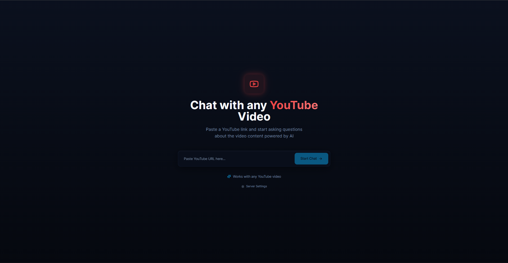

# YouTube Video Chatbot 🎥💬

A powerful RAG-based chatbot that allows you to have intelligent conversations about any YouTube video. Ask questions, get insights, and explore video content through natural language interactions.

## 🎬 Demo

[](https://drive.google.com/file/d/1VRrpcL5HuXYgo2KeuiK5J4f0T3xMxwA5/view?usp=sharing)

*Click the image above to watch the chatbot in action - loading videos, answering questions, and maintaining conversation context!*

## ✨ Features

### Core Capabilities
- **Multi-Source Transcript Extraction**: Automatically fetches transcripts from YouTube or uses Whisper AI for transcription
- **Multi-Language Support**: Translates non-English videos to English using advanced neural translation
- **Conversational Memory**: Maintains context across questions with session-based chat history
- **Real-Time Streaming**: Server-Sent Events (SSE) for smooth, responsive interactions
- **Smart RAG Pipeline**: Vector-based retrieval with FAISS for accurate, context-aware answers

### Technical Highlights
- **Intelligent Fallback System**: YouTube API → Whisper transcription → Translation pipeline
- **Lightning-Fast Transcription**: Batch processing with Faster Whisper (5-10 min videos in seconds)
- **Efficient Translation**: Local neural translation model for privacy and speed
- **Session Management**: Multi-session support with automatic memory trimming
- **RESTful API**: FastAPI backend with comprehensive endpoints and documentation

## 🏗️ Architecture

```
┌─────────────────┐
│  YouTube Video  │
└────────┬────────┘
         │
         ▼
┌─────────────────────────────────┐
│   Transcript Acquisition        │
│  ┌──────────────────────────┐  │
│  │ 1. YouTube Auto-Captions │  │
│  │ 2. Whisper Transcription │  │
│  └──────────────────────────┘  │
└────────┬────────────────────────┘
         │
         ▼
┌─────────────────────────────────┐
│   Translation (if needed)       │
│   HY-MT1.5-1.8B Model          │
└────────┬────────────────────────┘
         │
         ▼
┌─────────────────────────────────┐
│   Text Processing & Chunking    │
│   RecursiveCharacterTextSplitter│
└────────┬────────────────────────┘
         │
         ▼
┌─────────────────────────────────┐
│   Vector Store Creation         │
│   FAISS + HuggingFace Embeddings│
└────────┬────────────────────────┘
         │
         ▼
┌─────────────────────────────────┐
│   RAG Chain with Memory         │
│   LangChain + Session History   │
└────────┬────────────────────────┘
         │
         ▼
┌─────────────────────────────────┐
│   LLM Response Generation       │
│   GPT-4.1-nano (GitHub Models)  │
└─────────────────────────────────┘
```

## 🚀 Quick Start

### Prerequisites

- Python 3.8+
- CUDA-compatible GPU (recommended for transcription and translation if required)
- GitHub Personal Access Token (for GPT-4.1-nano access)
- `yt-dlp` installed (for audio extraction)

### Installation

1. **Clone the repository**
```bash
git clone https://github.com/FahimS45/yt_chatbot.git
cd yt_chatbot
```

2. **Install dependencies**
```bash
pip install -r requirements.txt
```

3. **Install yt-dlp** (for Whisper fallback)
```bash
# Linux/macOS
pip install yt-dlp

# Or using package manager
sudo apt install yt-dlp  # Debian/Ubuntu
brew install yt-dlp      # macOS
```

4. **Configure environment variables**

Create a `.env` file in the project root:
```env
GITHUB_TOKEN=your_github_token_here
```

Get your GitHub token from [GitHub Models Marketplace](https://github.com/marketplace/models/azure-openai/gpt-4-1-nano).

5. **Update configuration** (optional)

Edit `support/config.py` to customize:
- Model selections
- Batch sizes
- Memory settings
- Temperature parameters

### Running the Application

#### Option 1: Command Line Interface
```bash
python main.py
```

#### Option 2: API Server
```bash
cd support
uvicorn api:app --reload --host 0.0.0.0 --port 8000
```

Access API documentation at: `http://localhost:8000/docs`

## 📖 Usage

### Python API

```python
from main import YouTubeChatbot
import uuid

# Initialize chatbot
chatbot = YouTubeChatbot()

# Load a video
video_id = "hmtuvNfytjM"
youtube_url = "https://www.youtube.com/watch?v=hmtuvNfytjM"
result = chatbot.load_video(video_id, youtube_url)
print(result)

# Create a session
session_id = str(uuid.uuid4())

# Ask questions
response = chatbot.ask("What is this video about?", session_id)
print(response['answer'])

# Follow-up question (uses conversation memory)
response = chatbot.ask("Can you elaborate on that?", session_id)
print(response['answer'])
```

### REST API

#### Load a Video
```bash
curl -X POST "http://localhost:8000/load-video" \
  -H "Content-Type: application/json" \
  -d '{"url": "https://www.youtube.com/watch?v=hmtuvNfytjM"}'
```

#### Ask a Question (Streaming)
```bash
curl -X POST "http://localhost:8000/ask/stream" \
  -H "Content-Type: application/json" \
  -d '{
    "question": "What is this video about?",
    "session_id": "550e8400-e29b-41d4-a716-446655440000"
  }'
```

#### Non-Streaming Question
```bash
curl -X POST "http://localhost:8000/ask" \
  -H "Content-Type: application/json" \
  -d '{
    "question": "Summarize the main points",
    "session_id": "550e8400-e29b-41d4-a716-446655440000"
  }'
```

## 🔧 Configuration

### Whisper Settings (`config.py`)

```python
WHISPER_MODEL_SIZE = "turbo"        # Options: tiny, base, small, medium, large-v3-turbo, turbo
WHISPER_DEVICE = "cuda"             # Use "cpu" if no GPU available
WHISPER_COMPUTE_TYPE = "float16"    # Options: float16, float32, int8
WHISPER_BATCH_SIZE = 16             # Higher = faster, but more VRAM
WHISPER_BEAM_SIZE = 5               # Higher = more accurate, but slower
```

**Performance Benchmarks** (GTX 3070 Ti, 8GB VRAM):
- 5-minute video: ~10 seconds
- 10-minute video: ~20 seconds
- Batch size 16 + Beam size 5: Optimal speed/accuracy trade-off

### Translation Settings

```python
TRANSLATION_MODEL = "tencent/HY-MT1.5-1.8B"
```

**Performance Benchmarks** (GTX 3070 Ti, 8GB VRAM):
- 5-minute transcript: ~1 minute
- 15-minute transcript: ~2.5 minutes

### RAG Settings

```python
CHUNK_SIZE = 1000           # Characters per chunk
CHUNK_OVERLAP = 200         # Overlap between chunks
RETRIEVER_K = 5             # Number of chunks to retrieve
MEMORY_WINDOW_SIZE = 10     # Conversation turns to remember
LLM_TEMPERATURE = 0.2       # Response creativity (0-1)
```

## 📁 Project Structure

```
yt_chatbot/
├── main.py                          # Main application entry point
├── requirements.txt                 # Python dependencies
├── LICENSE                          # MIT License
├── README.md                        # This file
│
└── support/
    ├── api.py                       # FastAPI REST endpoints
    ├── config.py                    # Configuration settings
    ├── models.py                    # Pydantic request/response models
    ├── utils.py                     # Utility functions
    ├── streaming.py                 # SSE streaming handlers
    ├── transcript_processor.py      # YouTube transcript fetching & processing
    ├── whisper_transcriber.py       # Faster Whisper integration
    ├── rag_chain.py                 # RAG pipeline with LangChain
    └── memory_manager.py            # Session-based conversation memory
```

## 🎯 How It Works

### 1. Transcript Acquisition
The system attempts to fetch transcripts in order of preference:
1. **YouTube Auto-Generated Captions**: Fastest, no processing needed
2. **Whisper Transcription**: Fallback for videos without captions
   - Downloads audio using `yt-dlp`
   - Transcribes with Faster Whisper
   - Detects language automatically

### 2. Translation Pipeline
For non-English videos:
- Uses `tencent/HY-MT1.5-1.8B` neural translation model
- Runs locally on GPU for privacy and speed
- Maintains context and meaning accuracy

### 3. Document Processing
- Splits transcript into overlapping chunks (1000 chars, 200 overlap)
- Creates embeddings using `all-MiniLM-L6-v2`
- Stores in FAISS vector database for fast retrieval

### 4. Conversational RAG
- Retrieves top-K relevant chunks for each question
- Maintains conversation history (last 10 turns)
- Generates context-aware responses using GPT-4.1-nano
- Streams responses in real-time via SSE

## 🌟 Advanced Features

### Server-Sent Events (SSE)

The chatbot supports real-time streaming for better UX:

```javascript
// Frontend example
const eventSource = new EventSource('/ask/stream');

eventSource.onmessage = (event) => {
  const data = JSON.parse(event.data);
  
  switch(data.type) {
    case 'start':
      // Initialize response
      break;
    case 'token':
      // Append token to display
      displayToken(data.content);
      break;
    case 'end':
      // Finalize response
      break;
    case 'metadata':
      // Store session info
      break;
  }
};
```

### Session Management

```python
# Get all active sessions
sessions = chatbot.get_active_sessions()

# Clear specific session
chatbot.clear_session(session_id)

# Sessions auto-trim to last 10 conversation turns
```

### Multi-Video Support

```python
# Load different videos for different sessions
chatbot.load_video("video_id_1", "url_1")
session_1 = uuid.uuid4()

chatbot.load_video("video_id_2", "url_2")
session_2 = uuid.uuid4()

# Each session maintains separate context
```

## 🖥️ System Requirements

### Minimum Requirements
- **CPU**: 4+ cores
- **RAM**: 8GB
- **GPU**: Optional (CPU fallback available)
- **Storage**: 5GB free space

### Recommended Requirements
- **CPU**: 8+ cores
- **RAM**: 16GB+
- **GPU**: NVIDIA GPU with 6GB+ VRAM (for fast Whisper transcription)
- **Storage**: 10GB+ free space

### Developer's Setup
- **GPU**: NVIDIA GTX 3070 Ti (8GB VRAM)
- **RAM**: 32GB DDR4
- **OS**: Linux/Windows with CUDA support

## 🔌 API Endpoints

| Endpoint | Method | Description |
|----------|--------|-------------|
| `/` | GET | API information |
| `/health` | GET | Health check |
| `/load-video` | POST | Load YouTube video |
| `/load-video/stream` | POST | Load video with SSE progress |
| `/ask` | POST | Ask question (non-streaming) |
| `/ask/stream` | POST | Ask question with SSE streaming |
| `/clear-session` | POST | Clear session history |
| `/sessions` | GET | List active sessions |
| `/sessions` | DELETE | Clear all sessions |

Full API documentation available at `/docs` when running the server.

## 🤝 Contributing

Contributions are welcome! Please feel free to submit a Pull Request. For major changes:

1. Fork the repository
2. Create your feature branch (`git checkout -b feature/AmazingFeature`)
3. Commit your changes (`git commit -m 'Add some AmazingFeature'`)
4. Push to the branch (`git push origin feature/AmazingFeature`)
5. Open a Pull Request

## 📝 License

This project is licensed under the MIT License - see the [LICENSE](LICENSE) file for details.

## 🙏 Acknowledgments

- [Faster Whisper](https://github.com/SYSTRAN/faster-whisper) - Lightning-fast Whisper implementation
- [HY-MT1.5-1.8B](https://huggingface.co/tencent/HY-MT1.5-1.8B) - High-quality neural translation
- [LangChain](https://github.com/langchain-ai/langchain) - RAG framework
- [GitHub Models](https://github.com/marketplace/models) - GPT-4.1-nano access
- [Lovable](https://lovable.dev) - Frontend development platform

## 🐛 Troubleshooting

### Common Issues

**Issue**: `ModuleNotFoundError: No module named 'faster_whisper'`
```bash
pip install faster-whisper
```

**Issue**: CUDA out of memory during Whisper transcription
```python
# In config.py, reduce batch size
WHISPER_BATCH_SIZE = 8  # or 4
```

**Issue**: Translation taking too long
```python
# Use CPU for translation if GPU memory is limited
# Modify translation model loading in transcript_processor.py
device_map="cpu"  # instead of "auto"
```

**Issue**: `yt-dlp` not found
```bash
# Install yt-dlp
pip install yt-dlp
# Or system-wide
sudo apt install yt-dlp  # Linux
brew install yt-dlp      # macOS
```

## 📧 Contact

Fahim Shahriar - [@FahimS45](https://github.com/FahimS45)

Project Link: [https://github.com/FahimS45/yt_chatbot](https://github.com/FahimS45/yt_chatbot)

---

**⭐ If you found this project helpful, please consider giving it a star!**
